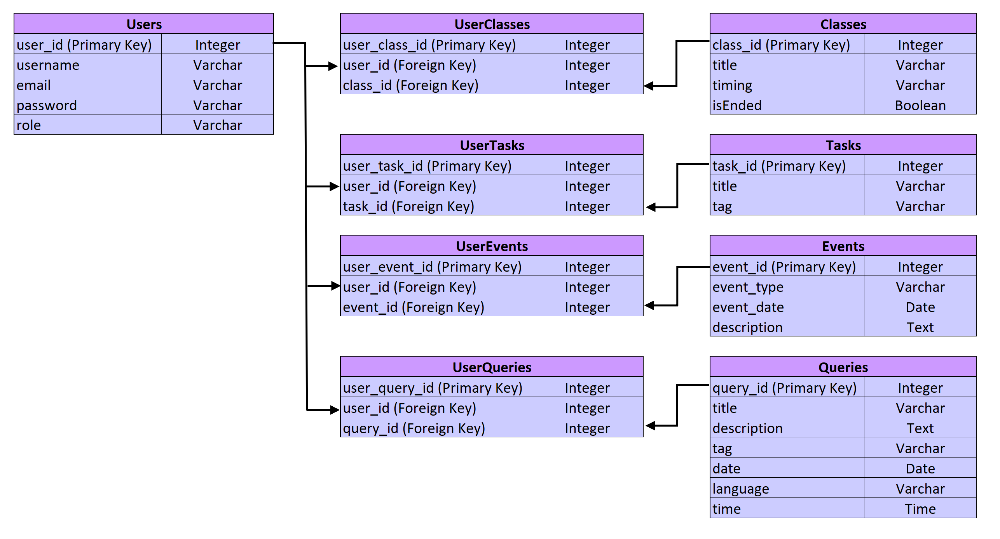

# ZenClass Portal Database Schema

## Overview
This project outlines the database schema for the **ZenClass Portal**, which manages **users**, **classes**, **tasks**, **queries**, and **events**. The system allows candidates and mentors to interact, assign tasks, resolve queries, and participate in events. The schema utilizes simple relationships and many-to-many linking tables to ensure data flexibility.

## Entities and Attributes

### 1. Users
| Column     | Data Type | Description                            |
|------------|------------|----------------------------------------|
| `user_id`  | Integer    | Primary Key (Unique Identifier)        |
| `username` | Varchar    | Username for the user                  |
| `email`    | Varchar    | Email address                          |
| `password` | Varchar    | Password for authentication            |
| `role`     | Varchar    | Role of the user (`candidate`, `mentor`)|

### 2. Classes
| Column      | Data Type | Description                               |
|-------------|------------|-------------------------------------------|
| `class_id`  | Integer    | Primary Key (Unique Identifier)           |
| `title`     | Varchar    | Title of the class                        |
| `timing`    | Varchar    | Timing of the class                       |
| `isEnded`   | Boolean    | Whether the class has ended (True/False)  |

### 3. Tasks
| Column     | Data Type | Description                          |
|------------|------------|--------------------------------------|
| `task_id`  | Integer    | Primary Key (Unique Identifier)      |
| `title`    | Varchar    | Title of the task                    |
| `tag`      | Varchar    | Tag for categorizing the task        |

### 4. Queries
| Column       | Data Type | Description                              |
|--------------|------------|------------------------------------------|
| `query_id`   | Integer    | Primary Key (Unique Identifier)          |
| `title`      | Varchar    | Title of the query                       |
| `description`| Text       | Detailed description of the query        |
| `tag`        | Varchar    | Tag for categorizing the query           |
| `date`       | Date       | Date the query was posted                |
| `language`   | Varchar    | Programming language related to the query|
| `time`       | Time       | Time of query submission                 |

### 5. Events
| Column        | Data Type | Description                                  |
|---------------|------------|----------------------------------------------|
| `event_id`    | Integer    | Primary Key (Unique Identifier)              |
| `event_type`  | Varchar    | Type of event (`Hackathon`, `Placement`, etc.)|
| `event_date`  | Date       | Date of the event                            |
| `description` | Text       | Description of the event                     |

## Linking Tables (Many-to-Many Relationships)

### 1. UserClasses
This table links **Users** and **Classes** to establish which users are part of which classes.

| Column          | Data Type | Description                           |
|-----------------|------------|---------------------------------------|
| `user_class_id` | Integer    | Primary Key                           |
| `user_id`       | Integer    | Foreign Key (References `Users`)      |
| `class_id`      | Integer    | Foreign Key (References `Classes`)    |

### 2. UserTasks
This table links **Users** and **Tasks** to assign tasks to users.

| Column         | Data Type | Description                          |
|----------------|------------|--------------------------------------|
| `user_task_id` | Integer    | Primary Key                          |
| `user_id`      | Integer    | Foreign Key (References `Users`)     |
| `task_id`      | Integer    | Foreign Key (References `Tasks`)     |

### 3. UserQueries
This table links **Users** and **Queries** to track which users posted or responded to queries.

| Column          | Data Type | Description                          |
|-----------------|------------|--------------------------------------|
| `user_query_id` | Integer    | Primary Key                          |
| `user_id`       | Integer    | Foreign Key (References `Users`)     |
| `query_id`      | Integer    | Foreign Key (References `Queries`)   |

### 4. UserEvents
This table links **Users** and **Events** to register users for events.

| Column         | Data Type | Description                          |
|----------------|------------|--------------------------------------|
| `user_event_id`| Integer    | Primary Key                          |
| `user_id`      | Integer    | Foreign Key (References `Users`)     |
| `event_id`     | Integer    | Foreign Key (References `Events`)    |

## Relationships
- **Users ↔ Classes**: Users can join multiple classes, and classes can have multiple users.
- **Users ↔ Tasks**: Users can be assigned multiple tasks, and tasks can involve multiple users.
- **Users ↔ Queries**: Users can create or resolve multiple queries, and queries can involve multiple users.
- **Users ↔ Events**: Users can participate in multiple events, and events can have multiple participants.

## ER Diagram

